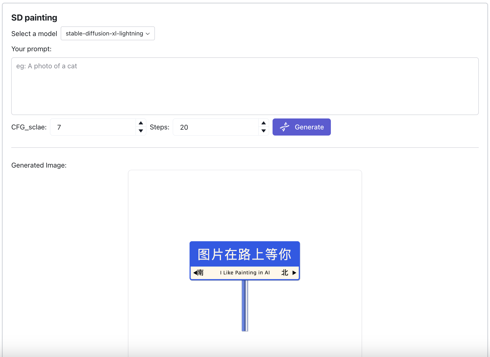
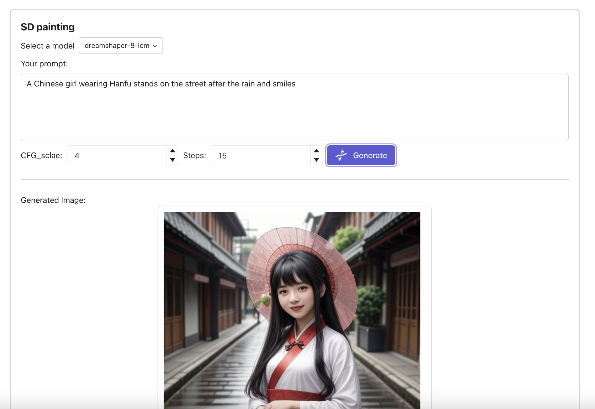

# myPaintAPP
 AI painting app based on Reflex and CloudflareAI

## Usage

Create a `.env` file then move it into `myPaintAPP` folder. Add the following to the `.env` file:

```bash
CLOUDFLARE_API_TOKEN=your_cloudflare_api_token
CLOUDFLARE_ACCOUNT_ID=your_cloudflare_worker_id
```

Then run the following commands:

```bash
python3 -m venv .venv
source .venv/bin/activate
pip install -r requirements.txt
reflex run
```

## screenshot


